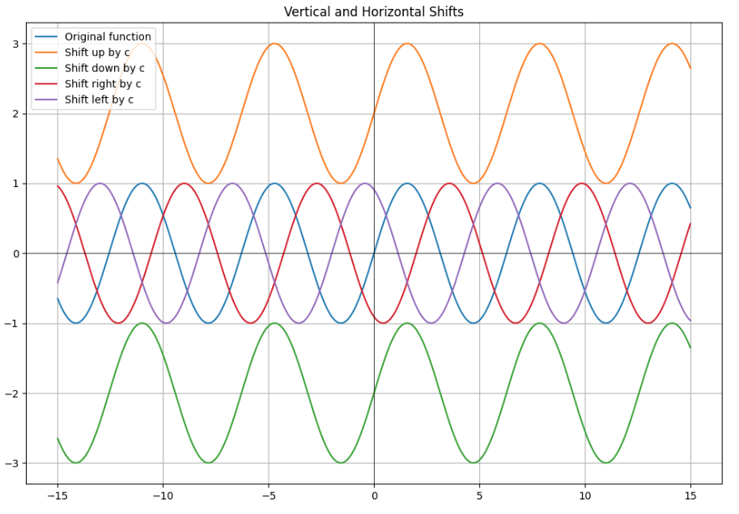

# 🌟 Data Driven Functions Project: The Math behind Science 💼

📖 **Mathematical Functions** 📖

Welcome to the guide aimed at empowering you with the knowledge of mathematical functions and their central role in the world of data science and artificial intelligence. 🌌🔍

---

🌐 **Project Overview**: 🌐

Dive deep into the essence of mathematical functions and explore how they intertwine with algorithms, models, and various AI techniques. Arm yourself with the foundational knowledge that sets the stage for advanced studies in data science. 🚀💡

---

📚 **What You Will Learn**: 📚

1️⃣ **Getting Acquainted with Perceptrons** 🧠💡
   - Dive into the basics of one of the foundational elements in machine learning. Understand why perceptrons are vital in neural networks.

2️⃣ **Mastering Error Calculations** ❌📊
   - Learn techniques to quantify and mitigate errors in your models. Mastering this ensures the optimized performance of your algorithms.

3️⃣ **Understanding the Domain and Range of a Function** 📈🔍
   - Dive into the fundamental concepts that dictate how mathematical functions operate. Gain insights into their characteristics and properties.

---

💼 **Why Is This Important?** 💼

Mathematical functions serve as the backbone of numerous algorithms in data science. By truly grasping and aptly applying them, you enhance your skill set, propelling your AI journey forward. The AI world is vast, and this knowledge will be your guiding compass. 🌍🧭

---

📜 **Lessons Index** 📜:

1. [Programming Functions](https://github.com/ivanozono/MathFuncsDSciencieAI/blob/main/(1)Programming_functions.ipynb)
2. [Sectioned Functions](https://github.com/ivanozono/MathFuncsDSciencieAI/blob/main/(2)Sectioned_Functions.ipynb)
3. [Composite Functions](https://github.com/ivanozono/MathFuncsDSciencieAI/blob/main/(3)Composite_Functions.ipynb)
4. [Characteristics of Mathematical Functions](https://github.com/ivanozono/MathFuncsDSciencieAI/blob/main/(4)Characteristics_of_Mathematical_Functions.ipynb)
5. [Manipulating Mathematical Functions](https://github.com/ivanozono/MathFuncsDSciencieAI/blob/main/(5)Manipulating_Mathematical_Functions.ipynb)
6. [Meet the Perceptron](https://github.com/ivanozono/MathFuncsDSciencieAI/blob/main/(6)Meet_the_Perceptron.ipynb)
7. [Activation Functions](https://github.com/ivanozono/MathFuncsDSciencieAI/blob/main/(7)Activation_Functions.ipynb)
8. [Simple Linear Regression](https://github.com/ivanozono/MathFuncsDSciencieAI/blob/main/(8)Simple_Linear_Regression.ipynb)
9. [Calculating Errors in ML and Linear Regression](https://github.com/ivanozono/MathFuncsDSciencieAI/blob/main/(9)Calculating_Errors_in_ML_and_Linear_Regression.ipynb)

---

Ivan Ozono |
Data Analyst | Machine Learning
sabel4008@gmail.com

✨ **Join Me on This Thrilling Journey!** ✨

Every AI enthusiast, whether a beginner or an expert, will find valuable insights in this guide. Let's embark on this thrilling journey together, navigating the intricacies of mathematical functions in the AI landscape! 🎓🌟

